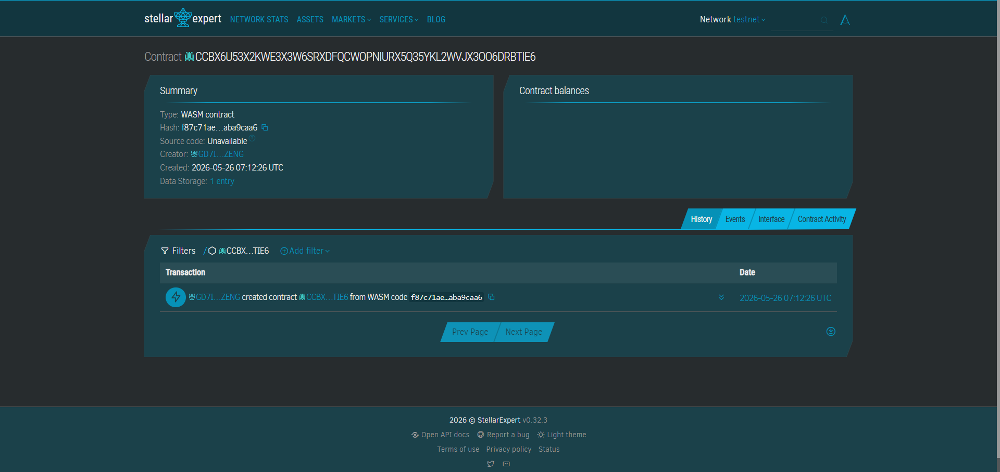
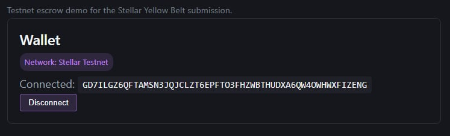
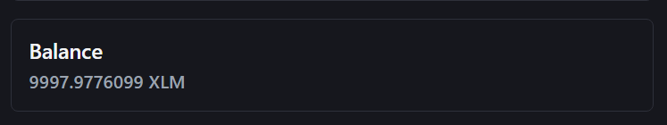
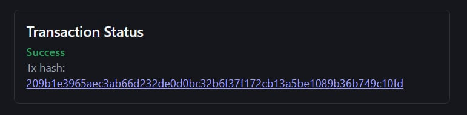
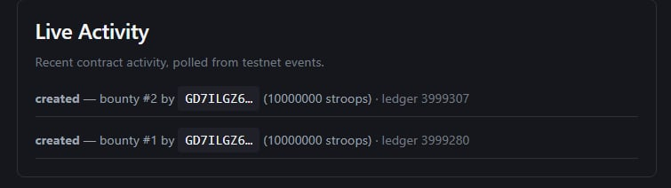
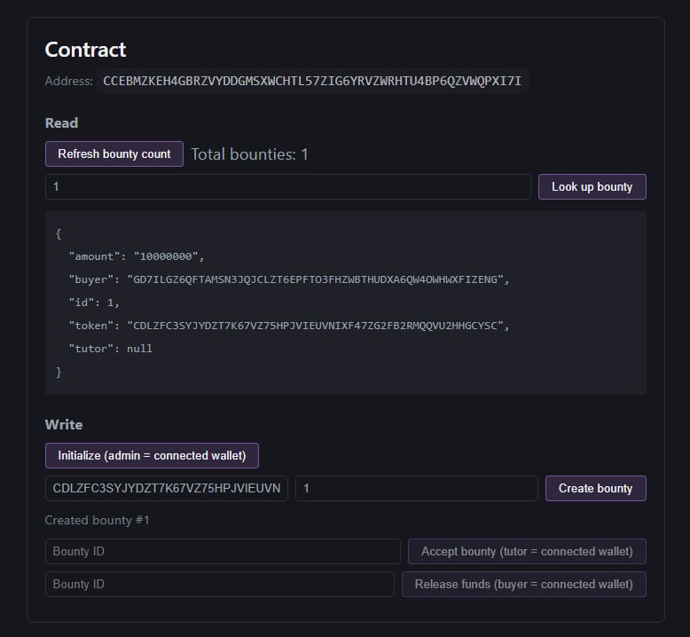

# StudyStake Bounties

[](https://github.com/JmGarcia30/studystake_bounties/actions/workflows/ci.yml)



A decentralized micro-task board built on Stellar Soroban for student peer-tutoring, with a
Vite/React/TypeScript frontend for the Level 2 Yellow Belt submission.

## Level 1 – White Belt

StudyStake includes an easy-to-find, classic Stellar payment flow alongside its Soroban bounty
features. The frontend uses `@creit.tech/stellar-wallets-kit` (including Freighter) to connect and
disconnect a wallet, request access, retrieve and display its public key, and sign transactions.
All account and payment operations use **Stellar Testnet**.

The wallet dashboard displays the native XLM balance from Testnet Horizon, including loading,
unfunded-account, error, and refresh states. The **Send XLM** card builds a standard
`Operation.payment` with `Asset.native()`, requests the connected wallet's real transaction
signature, submits the signed envelope to Horizon, and displays success/failure feedback, the
actual Horizon transaction hash, and a Stellar Expert Testnet link. No secret key, dummy
signature, fallback signature, or fabricated hash is used.

### Test the White Belt flow

1. Install [Freighter](https://www.freighter.app/).
2. Set Freighter to **Testnet**.
3. Fund the test account with [Friendbot](https://friendbot.stellar.org/).
4. Run the frontend using the setup commands below.
5. Select **Connect Wallet**, choose Freighter, and approve wallet access.
6. Verify that the public key, **Stellar Testnet** badge, and native XLM balance appear.
7. Enter another valid Testnet `G...` address in **Destination Stellar Address**.
8. Enter a small amount such as `0.1` XLM and select **Send XLM**.
9. Review and approve the transaction in Freighter.
10. Verify **XLM sent successfully**, the real transaction hash, and its Stellar Expert Testnet page.

### Level 1 screenshots (manual capture required)

Create `frontend/public/screenshots/level1/` and add these files only after completing the real
wallet/Testnet flow. Do not use the existing Soroban screenshots as proof of native XLM payment.

- `wallet-connected.png` — connected public key, Disconnect Wallet, and Stellar Testnet badge.
- `balance-displayed.png` — the connected account's native XLM balance.
- `xlm-transaction-approved.png` — Freighter approval or confirmed Testnet payment evidence.
- `xlm-transaction-result.png` — **XLM sent successfully**, actual hash, amount, and explorer link.


## Problem & Solution
**Problem:** A computer science student wants to earn income by peer-tutoring but lacks a way to guarantee payment for micro-transactions ($1–$5) without losing profit to payment gateway fees.
**Solution:** A Soroban smart contract acts as a trustless escrow vault. The buyer locks funds, which are instantly released to the tutor's wallet only when the work is confirmed complete.

## Timeline
Bootcamp friendly: Can be deployed and integrated with a frontend in 2-3 days.

## Stellar Features Used
* Micropayments
* Soroban smart contracts
* StellarWalletsKit multi-wallet frontend integration
* Contract events polled into a live activity feed

## Vision and Purpose
To empower low-income students to safely participate in the micro-gig economy without predatory fees or fear of digital theft.

---

## Project Structure

```
contracts/studystake_bounties/   # Soroban smart contract (Rust)
frontend/                        # Vite + React + TypeScript dApp
rust-toolchain.toml              # Pins the Rust toolchain used to build the contract
```

## Toolchain

| Tool | Version |
|---|---|
| Rust | 1.88.0 (pinned via `rust-toolchain.toml`) |
| WASM target | `wasm32v1-none` |
| Stellar CLI | 27.0.0 |
| Node.js | 20+ |

## Contract

Exported functions in `contracts/studystake_bounties/src/lib.rs`:

* `initialize(admin)` — one-time setup, sets the dispute admin.
* `create_bounty(buyer, token, amount)` — buyer locks `token` funds in escrow, returns a bounty ID.
* `accept_bounty(tutor, bounty_id)` — tutor takes an open bounty.
* `release_funds(buyer, bounty_id)` — buyer releases escrowed funds to the tutor.
* `resolve_dispute(admin, bounty_id, favor_buyer)` — admin routes funds to buyer or tutor.
* `get_bounty(bounty_id)` — read a single bounty (read-only, no auth).
* `get_bounty_count()` — read the total number of bounties created (read-only, no auth).

`create_bounty`, `accept_bounty`, `release_funds`, and `resolve_dispute` each emit a
`("bounty", <action>)` event with `(bounty_id, actor, amount)` data, which the frontend polls
via `getEvents` for the live activity feed.

> `src/test.rs` is wired into the crate via `mod test;` in `lib.rs` and runs with `cargo test`
> (5 tests covering the happy path, dispute resolution both ways, and unauthorized/duplicate
> action rejections).

### How to Build

```bash
stellar contract build
# or, without the Stellar CLI:
cargo build --target wasm32v1-none --release
```

Output: `target/wasm32v1-none/release/studystake_bounties.wasm`

### Deploying to Testnet

```bash
# 1. Create (or reuse) a testnet identity
stellar keys generate deployer --network testnet

# 2. Fund it via Friendbot
stellar keys fund deployer --network testnet

# 3. Deploy the built WASM
stellar contract deploy \
  --wasm target/wasm32v1-none/release/studystake_bounties.wasm \
  --source deployer \
  --network testnet

# 4. Initialize the contract once (admin = your deployer address)
stellar contract invoke \
  --id <DEPLOYED_CONTRACT_ADDRESS> \
  --source deployer \
  --network testnet \
  -- initialize --admin <YOUR_ADMIN_ADDRESS>
```

Copy the resulting contract address into `frontend/.env` as `VITE_CONTRACT_ID`.

## Yellow Belt Level 2 Proof

* **Deployed Contract Address:** `CCEBMZKEH4GBRZVYDDGMSXWCHTL57ZIG6YRVZWRHTU4BP6QZVWQPXI7I`
* **Contract Deploy Transaction Hash:** `18d81d9cf6470562686116fabaf1a8df0cd95c2fe352b271568fdc86bd29aa19`
* **Frontend Contract Call Transaction Hash:** `209b1e3965aec3ab66d232de0d0bc32b6f37f172cb13a5be1089b36b749c10fd`

---

## Frontend

Located in `frontend/`. Built with Vite + React + TypeScript, `@stellar/stellar-sdk`, and
`@creit.tech/stellar-wallets-kit` for multi-wallet support (Freighter, xBull, Lobstr, hardware
wallets, etc — whichever the kit's `defaultModules()` detects as installed).

### Setup

```bash
cd frontend
cp .env.example .env
# edit .env: paste your deployed VITE_CONTRACT_ID
npm install
npm run dev       # starts the dev server (see terminal for the local URL)
```

Other scripts: `npm run build`, `npm run preview`.

### Environment variables (`frontend/.env`, see `.env.example`)

| Variable | Purpose |
|---|---|
| `VITE_CONTRACT_ID` | Deployed StudyStake Bounties contract address |
| `VITE_TOKEN_ID` | Escrow token contract (defaults to the testnet native-XLM SAC, editable in the UI) |
| `VITE_RPC_URL` | Soroban RPC endpoint (testnet) |
| `VITE_HORIZON_URL` | Horizon endpoint (testnet), used to read XLM balances |
| `VITE_NETWORK_PASSPHRASE` | Testnet network passphrase |

No private keys or secrets are stored anywhere in this project — all signing happens in the
user's connected wallet extension.

### Features

* **Wallet panel** — connect/disconnect via the wallet picker modal, shows the connected public
  key and a "Stellar Testnet" network badge.
* **Balance panel** — fetches the connected wallet's XLM balance from Horizon, with loading and
  error states (including "unfunded account").
* **Contract panel** — shows the configured contract address; read section (`get_bounty_count`,
  look up a bounty by ID); write section (`initialize`, `create_bounty`, `accept_bounty`,
  `release_funds`) using the connected wallet as buyer/tutor/admin.
* **Transaction status panel** — `idle | pending | success | failed`, with a friendly error
  message and a link to the tx hash on [Stellar Expert](https://stellar.expert/explorer/testnet).
* **Live Activity feed** — polls recent contract events every ~6s and lists them newest-first;
  balance and bounty count refresh automatically after every successful transaction.

### Handled wallet/transaction errors

1. **No wallet available** — surfaced when the kit finds no installed/supported wallet.
2. **User rejected** connect or transaction signing — surfaced as "You cancelled the request in
   your wallet."
3. **Insufficient balance / simulation or submission failure** — surfaced as the underlying
   RPC/contract error message (e.g. failed simulation, trustline missing, contract panic).

See `frontend/src/lib/wallet.ts` (`toFriendlyError`) for the mapping.

---

## Manual setup checklist

- [x] Install a Stellar wallet browser extension (e.g. [Freighter](https://www.freighter.app/))
      and switch it to **Testnet**.
- [x] Fund your wallet address via [Friendbot](https://friendbot.stellar.org/).
- [x] Deploy the contract (see above) and fill in the deployed contract address here and in
      `frontend/.env` — see [Yellow Belt Level 2 Proof](#yellow-belt-level-2-proof).
- [x] Call `initialize` once, then use the frontend to create/accept/release a bounty and record
      the resulting transaction hash — see [Yellow Belt Level 2 Proof](#yellow-belt-level-2-proof).
- [x] Capture remaining screenshots (see checklist below) and add them to this README.

## Screenshots


### Wallet connected


### Balance displayed


### Contract call transaction success


### Live activity feed


### Bounty read result


### Screenshots checklist

- [x] Wallet options available (picker modal open)
- [x] Wallet connected (public key + testnet badge visible)
- [x] Balance displayed
- [x] Contract call transaction success (Transaction Status panel showing `success` + tx hash)
- [x] Activity/feed status update (Live Activity panel with at least one item)
