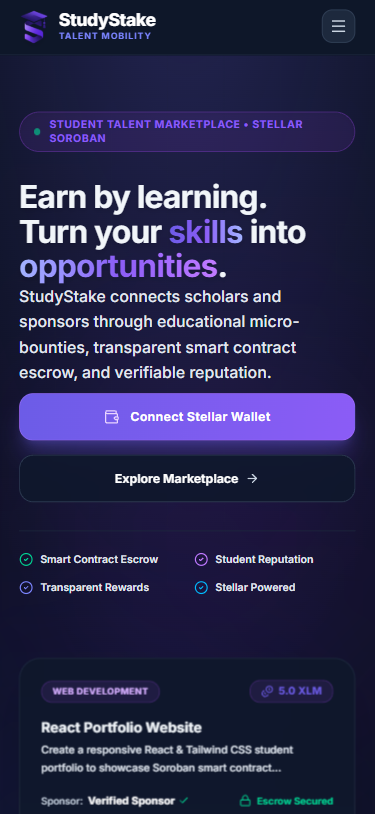
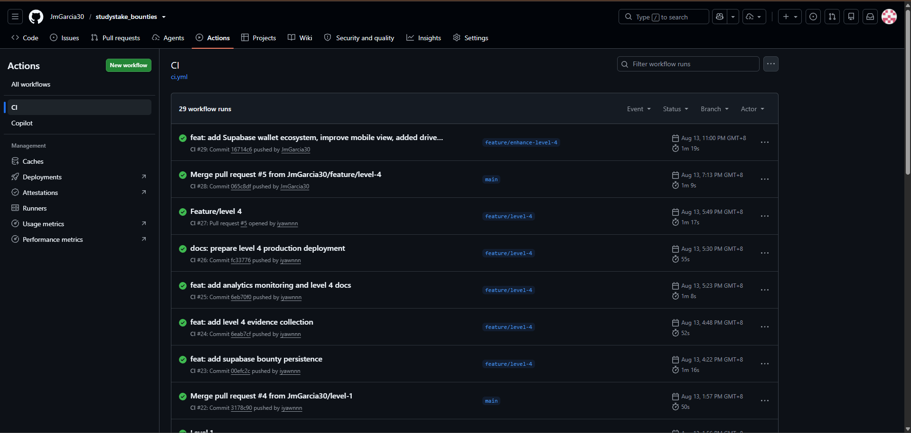
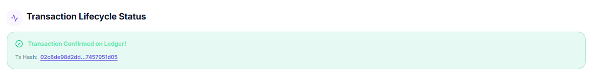
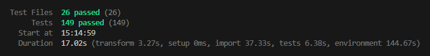

# StudyStake Bounties

[](https://github.com/JmGarcia30/studystake_bounties/actions/workflows/ci.yml)

StudyStake Bounties is a Stellar Testnet marketplace for educational micro-bounties. Sponsors can fund Soroban escrow tasks, contributors can submit proof of work, and testers can generate the wallet-interaction and feedback evidence required for Level 4 production validation.

> This MVP uses Stellar Testnet. Do not use mainnet funds or place secret keys, Supabase service-role keys, Sentry auth tokens, or other secrets in `VITE_` variables.

## Level 3 Submission Screenshots and Demo Video Link

### Mobile Responsive UI



### CI/CD Pipeline



### Transaction Hash



### Test Output



### Demo Video

[Watch the StudyStake Demo](https://drive.google.com/drive/folders/1hj2Dnc5bKjlIFXl0sL11XfmNNl0xOFr3)

📁 **[Google Drive Folder — Screenshots & Video Demo](https://drive.google.com/drive/folders/1cnY5wSDLDIY0rMTPq7BmYrrUxvYiIzho?usp=sharing)**

## Level 4 MVP features

- Multi-wallet connection and signature verification through Stellar Wallets Kit.
- Native XLM Testnet balance and wallet-signed XLM payments.
- Soroban bounty escrow create, accept, lookup, and reward-release flows.
- Supabase-backed bounty marketplace and proof submissions with a local fallback.
- Contributor submission history and live contract activity feed.
- Optional reputation contract integration.
- Level 4 wallet-interaction evidence and tester feedback collection.
- Optional GA4 product analytics and Sentry React error monitoring.
- Loading, success, failure, empty, and disconnected states across critical flows.

## Deployed contracts and network

| Item | Value |
|---|---|
| Network | Stellar Testnet |
| Bounties contract | `CCRBVQZ7IRASOIAQOWYYXV4UUJ2FPAVWMLULQW5KQBILXOXXFOMRXFA3` |
| Native-XLM Testnet SAC | `CDLZFC3SYJYDZT7K67VZ75HPJVIEUVNIXF47ZG2FB2RMQQVU2HHGCYSC` |
| Reputation contract | `CBFNKF5HOW5XJNH3DLTYUQADZI5C53BCDDLDYQ2PUFJE2IYAOLG7C32W` |
| RPC | `https://soroban-testnet.stellar.org` |
| Horizon | `https://horizon-testnet.stellar.org` |

The contract source is in `contracts/studystake_bounties/src/lib.rs`. Deployment and representative transaction evidence should be recorded in `docs/LEVEL4_SUBMISSION.md`.

## Project structure

```text
contracts/studystake_bounties/       Soroban escrow contract and Rust tests
contracts/studystake_reputation/     Optional reputation contract
frontend/                            Vite, React, and TypeScript application
docs/SUPABASE.md                     Persistence schema/policy and evidence queries
docs/LEVEL4_SUBMISSION.md            Final submission evidence template
docs/PRODUCTION_SMOKE_TEST.md        Post-deployment validation checklist
docs/FRONTEND_DEPLOYMENT.md          Vercel production deployment runbook
```

## Requirements

- Node.js 20+
- npm
- Rust 1.88.0, pinned by `rust-toolchain.toml`
- Stellar CLI 27+ for contract build/deployment work
- A Stellar wallet such as Freighter configured for Testnet
- A Friendbot-funded Testnet account for transaction testing

## Frontend environment variables

Copy `frontend/.env.example` to `frontend/.env.local` for local development. Hosting-provider variables must use the same names.

| Variable | Required | Purpose |
|---|---:|---|
| `VITE_CONTRACT_ID` | Yes | Deployed StudyStake Bounties contract |
| `VITE_TOKEN_ID` | Yes | Escrow token contract; configured for the native-XLM Testnet SAC |
| `VITE_RPC_URL` | Yes | Soroban RPC endpoint |
| `VITE_HORIZON_URL` | Yes | Horizon endpoint for balances and payments |
| `VITE_NETWORK_PASSPHRASE` | Yes | Stellar network passphrase |
| `VITE_REPUTATION_CONTRACT_ID` | No | Optional deployed reputation contract |
| `VITE_SUPABASE_URL` | No | Public Supabase project URL |
| `VITE_SUPABASE_ANON_KEY` | No | Public Supabase anonymous key; never use service role |
| `VITE_GA_MEASUREMENT_ID` | No | GA4 web-stream measurement ID, such as `G-XXXXXXXXXX` |
| `VITE_SENTRY_DSN` | No | Public browser Sentry DSN |
| `VITE_APP_ENV` | No | Monitoring environment, normally `production` |
| `VITE_APP_RELEASE` | No | Release/commit identifier shown in Sentry |

If Supabase variables are absent, bounty metadata and proof flows use `LocalBountyRepository`; shared Level 4 evidence and feedback are not persisted. If GA4 or Sentry variables are absent, their provider is a no-op and the app continues normally.

## Supabase setup

1. Create or select a Supabase project.
2. Apply the Phase 2 schema for `bounties`, `proof_submissions`, `wallet_interactions`, and `user_feedback`.
3. Enable RLS and apply the MVP policies documented in `docs/SUPABASE.md`.
4. Add the project URL and anon key to the frontend environment.
5. Keep evidence and feedback browser access insert-only; use protected Supabase tooling for reviewer totals and recent rows.
6. Run the verification/evidence queries in `docs/SUPABASE.md`.

## Run locally

```bash
cd frontend
npm install
# Copy .env.example to .env.local and enter public configuration values.
npm run dev
```

Open the Vite URL, set the wallet to Stellar Testnet, and fund the account through Friendbot before testing payments or escrow actions.

## Test and build

From `frontend/`:

```bash
npm run lint
npm run typecheck
npm run test
npm run build
npm run preview
```

Contract tests/builds run from the repository root:

```bash
cargo test
stellar contract build
```

## Analytics and monitoring

The frontend has vendor-isolated providers under `frontend/src/lib/`:

- `analytics.ts` conditionally loads the GA4 Google tag and sends named product events.
- `monitoring.ts` conditionally initializes Sentry React and reports errors caught by the application error boundary.

Tracked analytics events are `wallet_connected`, `proof_submitted`, `xlm_payment_sent`, `escrow_created`, `bounty_accepted`, `reward_released`, `feedback_submitted`, and `evidence_page_viewed`. Analytics does not send wallet addresses, proof URLs, feedback text, or transaction hashes. Those records remain in the controlled Supabase evidence workflow.

For production validation, use GA4 Realtime/DebugView and Sentry Issues/settings. Capture screenshots after running `docs/PRODUCTION_SMOKE_TEST.md`.

## Level 4 evidence collection

Supabase captures successful wallet, proof, XLM payment, and escrow interactions plus tester rating/comment submissions. Evidence writes are best-effort: analytics or evidence failures do not rewrite transaction logic or turn a successful blockchain/product operation into a failure.

Use:

- `docs/SUPABASE.md` for evidence queries and RLS notes.
- `docs/PRODUCTION_SMOKE_TEST.md` after deployment.
- `docs/LEVEL4_SUBMISSION.md` to assemble URLs, screenshots, 10-user results, feedback summary, demo video, limitations, and final checklist.

## Production deployment

The recommended frontend hosting target is Vercel with the project Root Directory set to `frontend`. See `docs/FRONTEND_DEPLOYMENT.md` for exact settings, production environment values, deployment steps, and rollback guidance.


1. Run all frontend verification commands.
2. Create a production project on a static Vite-compatible host.
3. Set public environment variables in the host; do not upload local env files.
4. Build with `npm run build` and publish `frontend/dist`.
5. Configure SPA fallback to `index.html` if the host requires it.
6. Run the production smoke-test checklist on the deployed URL.
7. Verify Supabase rows, GA4 Realtime events, Sentry environment/release, and Stellar Expert transaction links.
8. Record the production URL, release commit, screenshots, and demo video in the submission document.

## Known production considerations

- The current deployment is testnet-only.
- Anonymous evidence insert policies are suitable for MVP testing but require stronger identity, abuse prevention, and rate limiting before mainnet use.
- Browser analytics may be blocked by privacy tools and should not be treated as financial evidence.
- Closing a tab without selecting Disconnect cannot emit a disconnect event.
- Sentry source-map upload is not configured because it requires a private build-time auth token; add it only through the hosting CI secret store if needed later.

## StudyStake Screenshots and Video

View the product UI screenshots, mobile responsive design captures, analytics setup, and demo walkthrough videos:

📁 **[Google Drive Folder — StudyStake Screenshots and Video](https://drive.google.com/drive/folders/1cnY5wSDLDIY0rMTPq7BmYrrUxvYiIzho?usp=sharing)**

Replace or supplement it with the final Level 4 production walkthrough and complete every `TODO` in `docs/LEVEL4_SUBMISSION.md` before submission.
